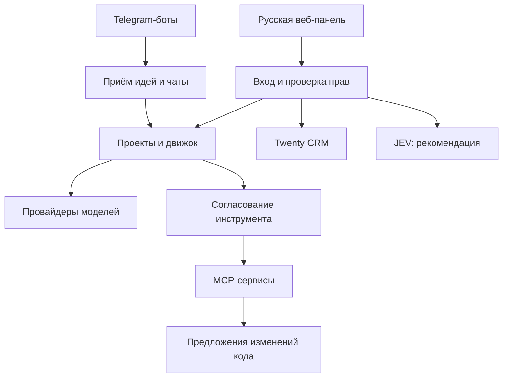

# Агентная ОС: архитектура и план развития

Дата: 25 сентября 2026. Статусы ниже описывают именно переданную сборку, а не обещанные функции. Источник статусов - исходный код и воспроизводимые тесты проекта. Внешние факты сопровождаются ссылками на документацию разработчиков.

## Решение

Система состоит из русскоязычного агентного ядра и подключаемого CRM-модуля Twenty. В ядре живут проекты, команды, чаты, навыки, согласования и исполнение. В CRM можно вести контакты, компании, обращения и почтовую историю. Агентное ядро читает нужные записи по API и создаёт из них задачи.

Это позволяет обновлять CRM отдельно от механизма исполнения. Цена такого решения: два отдельных входа, две базы и отсутствие готовой двусторонней синхронизации. Встроенный русский интерфейс принадлежит нашему ядру; перевод всего upstream Twenty не проверен.

Название Open CRM было приблизительным. Конкретный ранее подразумевавшийся репозиторий установить не удалось. Twenty выбран как архитектурное решение, не как подтверждение этого названия.

Кандидаты: Twenty предлагает расширяемые объекты и REST/GraphQL; EspoCRM тоже имеет REST API и Docker. Для этой сборки выбран Twenty, с сохранением исходного приложения «Агентная» в роли исполнительного сервиса. Источники: [Twenty repository](https://github.com/twentyhq/twenty), [Twenty API](https://docs.twenty.com/developers/extend/api), [EspoCRM API](https://docs.espocrm.com/development/api/), [EspoCRM Docker](https://docs.espocrm.com/administration/docker/installation/).

## Модули и границы доверия

Модель не получает ключи API и не владеет сессией администратора. Инструкции навыка не являются правами доступа. Внешний MCP - отдельный доверенный оператором сервис: его каталог и ответы считаются недоверенными данными, а фактические права его токена необходимо ограничивать на самом сервере.

## Сущности

| Сущность | Содержание и поведение |
| --- | --- |
| Проект | Цель, агенты, оркестратор, пул навыков, флаг автоматического создания агентов |
| Агент | Роль, системная инструкция, провайдер/модель, температура, лимит ответа, маска, навыки и grants MCP |
| Навык | Название, описание, текст, enabled, счётчик ревизии; история предыдущих текстов отдельно не хранится |
| Маска | Текст стиля общения; полномочий не добавляет |
| Задача | Описание, проект, DAG шагов, состояние, результаты, расход и резерв токенов |
| Чат | История сообщений, агент или модель, проект, состояние фонового ответа |
| Подключение | Бот/соцсеть/webhook с отдельными настройками и зашифрованными секретами |
| MCP-сервер | HTTPS URL, зашифрованный Bearer, проверенный каталог инструментов |
| Запрос инструмента | Агент, инструмент, точные аргументы, родительская задача/чат, fingerprint прав, срок, состояние и результат |
| Автоматизация | Проект, задание, интервал, лимит числа запусков/токенов, время и ID последнего запуска |

Хранилище ядра - SQLite WAL, один процесс с файловой блокировкой. Это намеренная граница текущего MVP. При дальнейшем росте предлагаются PostgreSQL, отдельные очереди и worker-процессы; они ещё не подключены к ядру. PostgreSQL и Redis в профиле Twenty обслуживают именно CRM.

## Как выполняется работа

1. Идея поступает через веб или разрешённого Telegram-бота.
2. Приёмная модель предлагает решение. Владелец правит или одобряет предложение.
3. Оркестратор выбирает существующих агентов проекта. Если разрешено, создаёт новых, назначая навыки только из одобренного пула. Новые агенты не получают MCP-права автоматически.
4. Сервер проверяет структуру плана: уникальность этапов, зависимости, отсутствие циклов, провайдеров и ограничения проекта.
5. Независимые этапы исполняются параллельно, зависимые получают результаты предыдущих. Глобальный предел ядра - три модельных вызова; параметр задан в `app/engine.py`.
6. Агент с MCP-правами может предложить конкретный инструмент. Сервер валидирует схему аргументов и создаёт запрос на согласование.
7. Владелец видит адрес, инструмент и аргументы. В вебе нажимает одобрение; в Telegram сначала открывает `/tool ID`, потом отдельной командой `/approve ID` подтверждает вызов.
8. Перед вызовом сервер повторно проверяет полномочия и актуальный каталог. Изменение настроек или описания инструмента аннулирует согласование. Двойное нажатие не должно создавать второй вызов.
9. Успешный ответ инструмента поступает агенту как недоверенные данные. Он продолжает работу и формирует итог.
10. Публикации через встроенные адаптеры остаются отдельной цепочкой «черновик → одобрение → отправка».

Ручной путь: проект → выбрать агентов → создать последовательный либо параллельный план → поправить зависимости и инструкции → запустить. Вызов оркестратора для создания ручного плана не нужен.

## Telegram

Каждая запись подключения имеет собственный токен, allowlist user ID, проект, режим, агента и настройки моделей. В коде нет общего ограничения числа записей ботов. Это не обещание бесконечной одновременной нагрузки: каждый бот использует polling-задачу и ресурсы Telegram/сервера. Максимум разрешённых пользователей одной записи сейчас десять; все они считаются доверенными операторами, а не сотрудниками с различными ролями.

Режимы: приём идей с согласованием и прямой чат с конкретным агентом. Голос требует включённой транскрипции и отдельного поддержанного API. `/status` показывает состояние ОС, `/tasks` - задачи текущего пользователя/бота. Одобрение MCP проверяет связь запроса с этим ботом и пользователем. Самостоятельного поиска чужих чатов и авторассылок нет.

Транспорт основан на официальном [Telegram Bot API](https://core.telegram.org/bots/api). Актуальные лимиты площадки не заменяются отсутствием лимита записей внутри нашей ОС.

## JEV

JEV подтверждён по официальной документации TypeSafe. Это модель структурированных решений: Choice выбирает вариант, Score оценивает по рубрике, Noul возвращает вероятность ответа «да». Она не является заменой модели для обычного чата. Источник: [TypeSafe introduction](https://docs.typesafe.ai/introduction).

Реализовано: выбор агента из заданного списка и отдельный сигнал, связан ли запрос с потенциально значимыми изменениями. Запрос отправляется только на `https://api.typesafe.ai/v1/systemone`, авторизация Bearer. Ключ вводится в настройках и шифруется. Модель по умолчанию закреплена как `jev-1.13.0`, поле можно менять. Источники: [HTTP API](https://docs.typesafe.ai/api), [модели](https://docs.typesafe.ai/models).

Порог 0,8 в приложении - начальная настройка, не проверенная гарантия точности. При низкой уверенности или сигнале риска показывается необходимость проверки. Даже высокая оценка никогда не разрешает инструмент. В этой сборке рекомендация вызывается вручную из проекта. Автоматическое распределение всех задач через JEV и выбор навыков именно JEV пока не реализованы. Для русскоязычных задач нужна собственная оценка качества; поставщик указывает, что качество зависит от языка: [TypeSafe models](https://docs.typesafe.ai/models).

Предлагаемые следующие применения: сортировка входящих заявок, выбор дешёвой/сильной модели, проверка полноты результата, поиск противоречий с приложенными источниками. Эти расширения - проектные предложения, не скрытые функции сборки.

## Подключения

| Сервис | Текущий путь | Что потребуется / граница |
| --- | --- | --- |
| Telegram | Встроенные боты, polling, идеи/чат/голос | Токен, user ID; реальный аккаунт в этой сборке не проверен |
| OpenAI, Anthropic, Gemini | Существующие текстовые адаптеры ядра | Собственный API-ключ и доступная модель |
| Другие LLM | OpenAI-compatible HTTPS endpoint | Реальная совместимость конкретного провайдера проверяется отдельно |
| JEV | Специальный официальный REST-адаптер | TypeSafe key; не используется как chat/completions |
| Twenty | HTTPS REST, чтение объекта и импорт записи | URL, API key с узкой ролью, имена объекта/поля из схемы рабочей области |
| Почта | Возможности Twenty или внешний MCP | Самостоятельного OAuth/IMAP/SMTP-клиента ядра нет |
| VK | Сохранённый адаптер текстовой публикации | Токен и owner_id, права на стену; медиа не добавлены |
| Instagram | Сохранённый адаптер публикации готового медиа | Аккаунт, токен, версия API и публичный URL; текущие условия Meta требуют отдельной проверки |
| YouTube | Сохранённый OAuth-адаптер загрузки | Client ID/secret, refresh token, права, готовое видео |
| Иные сервисы | MCP или одобренный webhook | Отдельные ключи/права; не заявляется универсальная совместимость |

Twenty документирует привязку почтовой истории к CRM-записям: [Mailbox](https://docs.twenty.com/user-guide/calendar-emails/capabilities/mailbox). Параметры self-hosted интеграций и OAuth: [Setup](https://docs.twenty.com/developers/self-host/capabilities/setup). Точная API-схема Twenty зависит от рабочей области: [APIs](https://docs.twenty.com/developers/extend/api).

Страницы Meta и VK в ходе текущей проверки полноценно получить не удалось. Поэтому актуальность всех требований к review приложений, токенам и типам аккаунта я не могу подтвердить. Адаптеры не следует считать боево проверенными. Официальные точки проверки: https://developers.facebook.com/docs/instagram-platform/ и https://dev.vk.com/ru/method/wall.post .

## Безопасность

| Угроза | Реализованная мера | Остаточная граница |
| --- | --- | --- |
| Кража базы | Ключи провайдеров, MCP, JEV, CRM и соцсетей шифруются; MASTER_KEY отдельно | Доступ к базе вместе с MASTER_KEY раскрывает секреты |
| Подбор входа | Argon2id, ограничение попыток, TOTP | Нет полноценной командной IAM и recovery codes |
| CSRF/подмена адреса | Exact Origin/Host и session CSRF, HttpOnly SameSite cookie | HTTPS включается конфигурацией VPS |
| XSS | Вывод недоверенного текста через textContent, CSP без внешних CDN | Нужны проверки каждой новой формы и зависимости |
| SSRF | Публичный HTTPS, закрепление DNS/IP, запрет private IP, redirect и proxy inheritance | Исходящий домен выбран владельцем; он может быть недоверенным |
| Prompt injection | Модель не имеет прямых ключей; tool allowlist и отдельное согласование | Текст модели всё ещё может ввести владельца в заблуждение |
| Изменение MCP | Повторная загрузка каталога перед выполнением и fingerprint | Сервер может изменить внутреннюю реализацию без изменения схемы |
| Повтор действия | Атомарный переход состояния, отсутствие автоповтора после неопределённого исхода | Сам оператор должен сверить внешний сервис |
| Самоизменение ОС | Исходники только для чтения, отдельные предложения с SHA-256 и diff | Автоматическое тестирование/применение ещё не реализованы |
| Восстановление backup | Сессии очищаются; боты, расписания, MCP/JEV/CRM отключаются; старые согласования сбрасываются | Резервирование Twenty и proposals выполняется отдельно |

Рекомендации протокола, на которых основана граница MCP: [Security Best Practices](https://modelcontextprotocol.io/specification/latest/basic/security_best_practices), [Streamable HTTP](https://modelcontextprotocol.io/specification/2025-11-25/basic/transports). Эти ссылки не являются сертификатом безопасности нашей реализации.

Логи содержат рабочие тексты и аргументы; не вводите в них ключи. Собственный MCP-токен редактируется при возврате сервиса, но произвольные секреты, которые внешний сервис вернёт в данных, автоматически распознать нельзя. База и резервные копии содержат историю задач и должны защищаться как пользовательские данные.

## Улучшение через собственных агентов

Реализован отдельный MCP-сервис: `source_list`, `source_read`, `propose_change`, `service_status`. Он работает под отдельным пользователем, читает только явно смонтированные исходники и пишет предложения в отдельный volume. Запрещены скрытые файлы, выход за корень, симлинки, shell и рабочая запись в исходники. Предложение связано с SHA-256 исходного содержимого.

Владелец подключает этот endpoint, выдаёт инструменты агенту-разработчику и привязывает его к Telegram. Агент читает код, предлагает новое содержимое и сохраняет diff после одобрения. Дальше владелец переносит предложение в отдельную ветку, запускает тесты, просматривает результат и развёртывает новую версию. Автоматические PR, выполнение тестов недоверенного кода и rollout/rollback - следующий самостоятельный этап. Для него нужен изолированный runner с ограниченной сетью, без production secrets и Docker socket.

## Приоритет продолжения

1. Приёмка с одним настоящим провайдером, одним ботом и безопасным MCP чтения.
2. Поднять Twenty, создать владельца, закрыть публичную регистрацию, выдать ограниченный API key; проверить импорт своей записи.
3. Подключить нужную почту через Twenty и проверить фактические OAuth scopes. Выбрать первый реальный рабочий процесс.
4. Проверить JEV на размеченных русских задачах; только после этого решать, где его автоматический маршрут полезен.
5. Изолированный coding runner, Git-ветки, CI и отдельное согласование применения.
6. PostgreSQL/очередь для ядра, роли пользователей, ограничение расходов по деньгам, пагинация, полноценная история навыков и двусторонняя CRM-синхронизация.

Это очередность предлагаемого развития. Пункты не представлены как уже реализованные.
